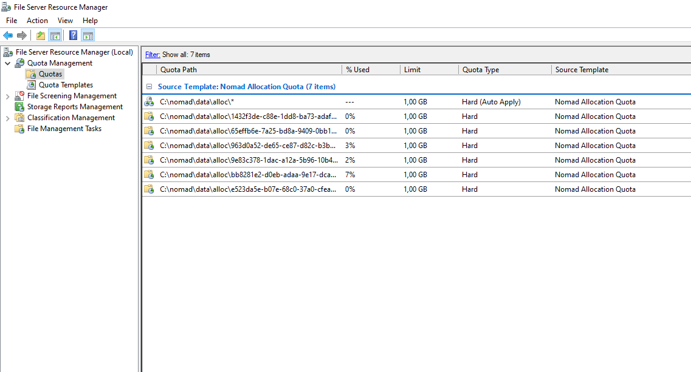

# Allocation Directory Quota

As the operator of a Windows-node-fleet, you may want to define a disk usage quota for every allocation directory, so that a single job cannot eat up the entire disk space.
Luckily, on Windows there's something called *File System Resource Manager*, or short *FSRM*.

:::tip
You can find more information about *FSRM* here: [https://learn.microsoft.com/en-US/windows-server/storage/fsrm/fsrm-overview](https://learn.microsoft.com/en-US/windows-server/storage/fsrm/fsrm-overview)
:::

## Installation

*FSRM* is not installed by default on Windows Server. Simply run the following Powershell command to install it.

```ps1
Install-WindowsFeature -Name FS-Resource-Manager, RSAT-FSRM-Mgmt
```

:::tip
Of course you can also install this by using the Server Manager GUI. You'll find it under *File and Storage Services > File and iSCSI Services*.
:::

## Configuration

We first create a *Quota Template*, defining the actual file size limit. Adjust the size acordingly and run:

```ps1
New-FsrmQuotaTemplate -Name "Nomad Allocation Quota" -Description "Limits every Nomad allocation directory" -Size 1GB
```

Now we can use the very cool feature of *Auto Apply*-quotas and create one for our alloc-directory.  
Auto-apply quotas automatically apply to every subfolder, which means, that every alloc-directory can now consume up to 1GB.
If someone tries to save more than 1GB, he will see the classic "Disk full"-error.

```ps1
New-FsrmAutoQuota -Path "C:\nomad\data\alloc" -Template "Nomad Allocation Quota"
```

## FSRM Overview

Everything can also be managed by using the *FSRM*-GUI and you have a nice overview of the actual usage.


